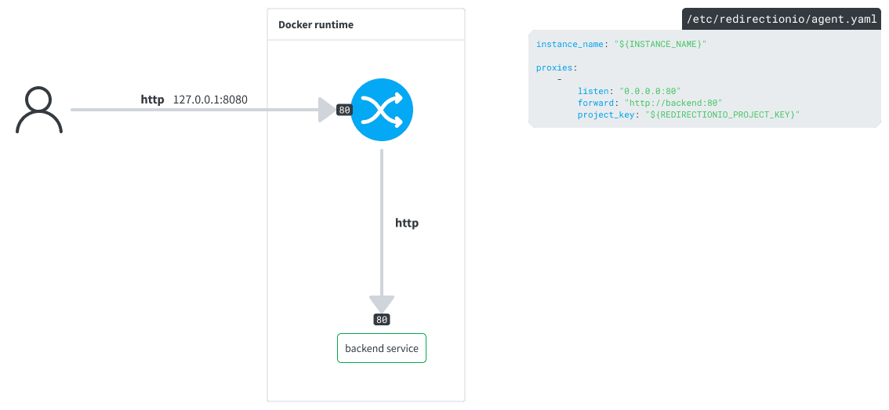

# Using the redirection.io agent as a reverse proxy in a Docker environment

This example shows how to use the redirection.io agent as a reverse proxy in a Docker environment. It is the most simple and versatile way to install redirection.io in your Docker stack, as it can be used with any backend service. The redirection.io agent act as a very fast reverse proxy, intercepting requests and responses between the client and the backend service.

> [!TIP]
> You can read more about [the redirection.io agent as a reverse proxy in our documentation](https://redirection.io/documentation/developer-documentation/the-agent-as-a-reverse-proxy).

## Description

The `service` directory contains the **redirectionio-agent** service: a simple Dockerfile to get the agent running. The [`/etc/redirectionio/agent.yml`](./services/redirectionio-agent/etc/redirectionio/agent.yml) file is used to configure the agent and proxify the traffic to a backend service.

The `docker-compose.yml` file also mentions a `nginx` service, which is a simple Nginx server used as a backend service. You can replace it with your own backend service.

### redirectionio-agent

The agent is installed using our [manual installation](https://redirection.io/documentation/developer-documentation/installation-of-the-agent#manual-installation) instructions. Note that we have enabled a `/var/lib/redirectionio` volume, used to store [redirection.io agent's cache data](https://redirection.io/documentation/developer-documentation/agent-configuration-reference#datadir).
