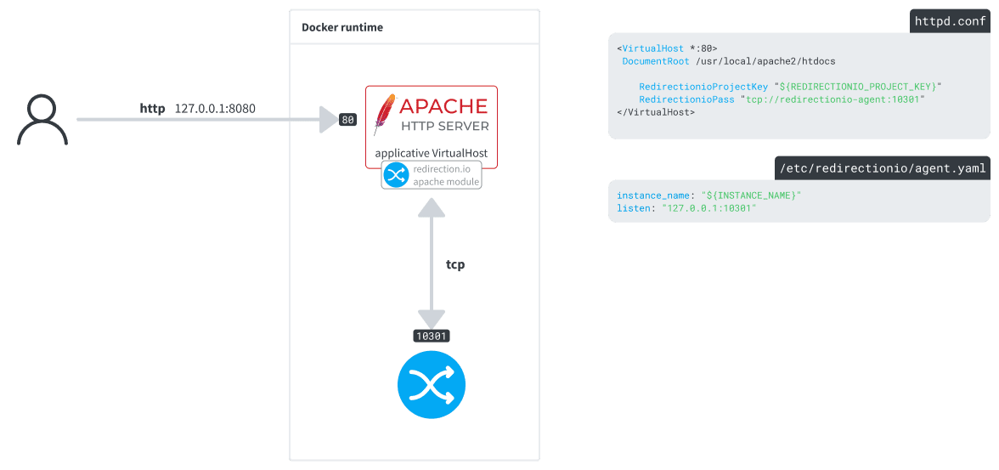

# Compiling the redirection.io Apache module in a Docker environment

It may happen that your hosting provider or provisioning solution installs a custom version of Apache, in non-standard paths or with incompatible dependencies. In this case, you may need to compile the redirection.io Apache module [from the sources](https://github.com/redirectionio/libapache2-mod-redirectionio).

This example shows how to compile the redirection.io Apache module and load it in the latest release of the Apache image.

## Description

The `service` directory contains two services:

 * **apache**: an Apache Dockerfile based on the [`httpd`](https://hub.docker.com/_/httpd/) image, with redirection.io Apache module compiled from the sources.
 * **redirectionio-agent**: a simple Dockerfile to get the agent running

### apache

redirection.io offers APT and RPM repositories, with many versions of
`libapache2-mod-redirectionio` to match classical distribution apache packages.
However, should your apache2 install vary from these traditional layouts, you will
be forced to compile our apache module yourself, to match your own apache version.

This is what the [apache Dockerfile](./services/apache/Dockerfile) achieves. Basically:
 * it downloads and builds the libredirectionio
 * it downloads the redirection.io apache2 module
 * it builds this module
 * it moves the built module in the right folder
 * it [loads the module](./services/apache/Dockerfile#L61) in the Apache configuration
 * it [enables redirection.io for the server](./services/apache/usr/local/apache2/conf/extra/httpd-vhosts.conf#L4-L5)

### redirectionio-agent

The agent is installed using our [manual installation](https://redirection.io/documentation/developer-documentation/installation-of-the-agent#manual-installation) instructions. Note that we have enabled a `/var/lib/redirectionio` volume, used to store [redirection.io agent's cache data](https://redirection.io/documentation/developer-documentation/agent-configuration-reference#datadir).
