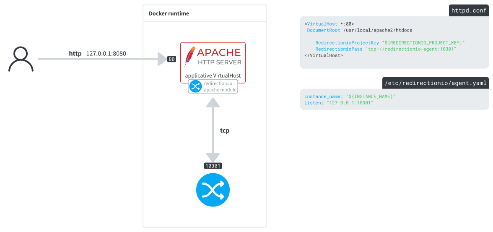

# Using the redirection.io Apache module in a Docker environment

We distribute our Apache module as [Debian/Ubuntu](https://redirection.io/documentation/developer-documentation/apache-module#debian-and-apt-based-distributions) or [Red Hat](https://redirection.io/documentation/developer-documentation/apache-module#red-hat-and-rpm-based-distributions) packages, which are available in our repositories.

This example shows how to use the pre-compiled redirection.io Apache module provided in our repositories in a Docker environment.

> [!TIP]
> If your Apache setup is not compatible with our pre-compiled packages, you can [compile the module from sources](../apache-module-custom/README.md).

## Description

The `service` directory contains two services:

 * **apache**: an Apache Dockerfile based on the Ubuntu 24.04 image, with Apache and the redirection.io Apache module installed from our apt repository
 * **redirectionio-agent**: a simple Dockerfile to get the agent running

### apache

This is a standard Ubuntu 24.04 image, with the distribution-provided apache2 package, and [libapache2-mod-redirectionio installed from our deb repository, as explained in our documentation](https://redirection.io/documentation/developer-documentation/apache-module#debian-and-apt-based-distributions).

It defines a single VirtualHost, [for which redirection is enabled](./services/apache/etc/apache2/sites-enabled/000-default.conf#L15-L16).

### redirectionio-agent

The agent is installed using our [manual installation](https://redirection.io/documentation/developer-documentation/installation-of-the-agent#manual-installation) instructions. Note that we have enabled a `/var/lib/redirectionio` volume, used to store [redirection.io agent's cache data](https://redirection.io/documentation/developer-documentation/agent-configuration-reference#datadir).
