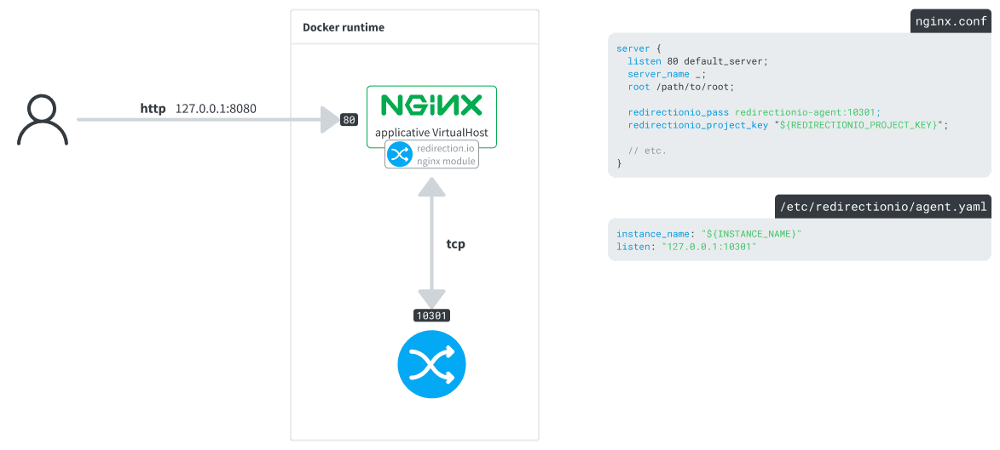

# Compiling the redirection.io nginx module in a Docker environment

It may happen that your hosting provider or provisioning solution installs a custom version of nginx, in non-standard paths or with incompatible dependencies. In this case, you may need to compile the redirection.io nginx module [from the sources](https://github.com/redirectionio/libnginx-mod-redirectionio).

This example shows how to compile the redirection.io nginx module and load it in the latest release of the nginx image.

## Description

The `service` directory contains two services:

 * **nginx**: an nginx Dockerfile based on the [`nginx`](https://hub.docker.com/_/nginx/) image, with redirection.io nginx module compiled from the sources.
 * **redirectionio-agent**: a simple Dockerfile to get the agent running

### nginx

Nginx dynamic modules require binary compatibility to be properly loaded, which
means that they have to be compiled with the exact same configuration directives
like your `nginx` binary.

redirection.io offers APT and RPM repositories, with many versions of
`libnginx-mod-redirectionio` to match classical distribution nginx packages.
However, should your nginx install vary from these traditional layouts, you will
be forced to compile our nginx module yourself, to match your own nginx version.

This is what the [nginx Dockerfile](./services/nginx/Dockerfile) achieves. Basically:
 * it downloads and builds the libredirectionio
 * it downloads the nginx sources in the same version like the installed `nginx` binary
 * it downloads the redirection.io nginx module
 * it builds this module with the same configure arguments the installed `nginx` binary was configured
 * it moves the built module in the right folder
 * it [loads the module](./services/nginx/etc/nginx/nginx.conf#L7) in the nginx configuration
 * it [enables redirection.io for the server](./services/nginx/etc/nginx/templates/default.conf.template#L6-L7)

### redirectionio-agent

The agent is installed using our [manual installation](https://redirection.io/documentation/developer-documentation/installation-of-the-agent#manual-installation) instructions. Note that we have enabled a `/var/lib/redirectionio` volume, used to store [redirection.io agent's cache data](https://redirection.io/documentation/developer-documentation/agent-configuration-reference#datadir).
